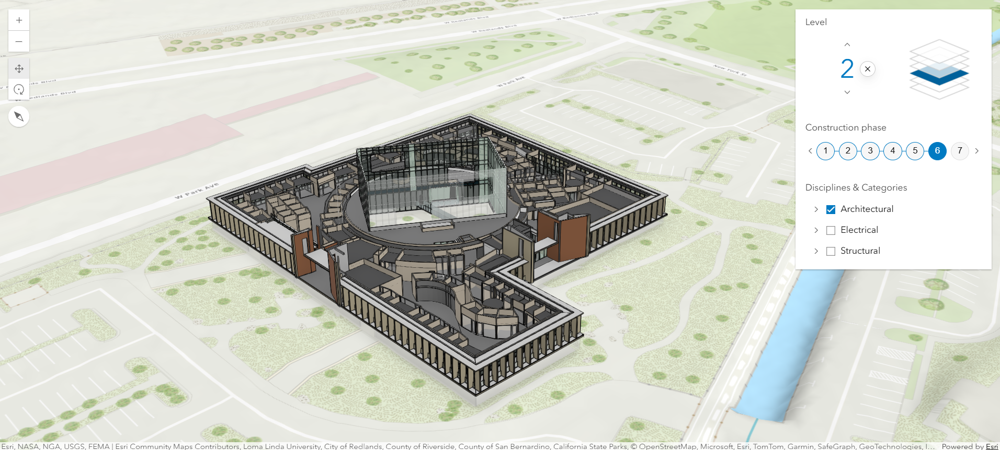
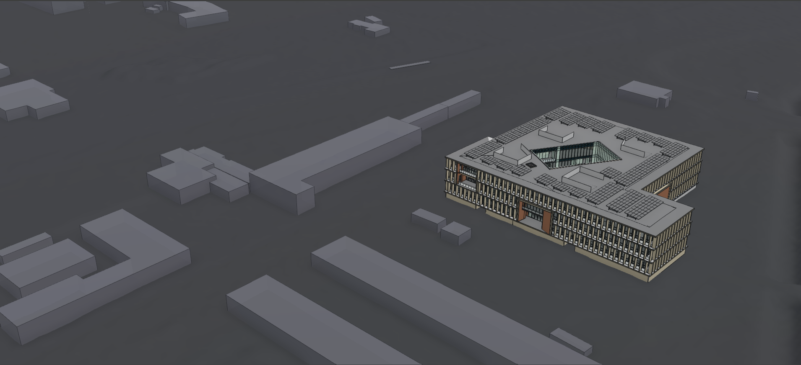
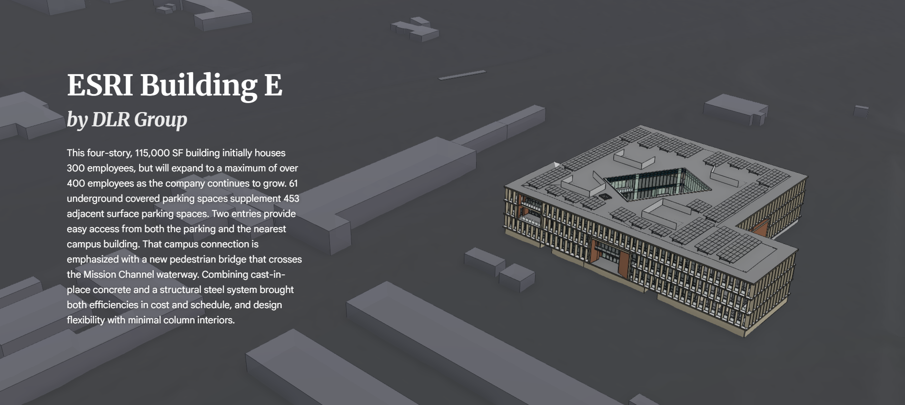

# Expanding on our Building Viewer web app

Last week, we developed a Building Viewer web app that displayed a model with some basic interactivity (e.g. filter by level, construction phase, and/or disciplines/categories):



We used [Esri's pre-built web components](https://developers.arcgis.com/javascript/latest/references/map-components/) to make this fast and easy:

```html
<arcgis-scene item-id="f477c289e93347aba6a0c052bfe0e0a4">
  <arcgis-zoom slot="top-left"></arcgis-zoom>
  <arcgis-navigation-toggle slot="top-left"></arcgis-navigation-toggle>
  <arcgis-compass slot="top-left"> </arcgis-compass>
  <arcgis-building-explorer slot="top-right"></arcgis-building-explorer>
</arcgis-scene>

<script type="module">
  const viewElement = document.querySelector("arcgis-scene");
  await viewElement.viewOnReady();

  viewElement.map.allLayers.forEach((layer) => {
    if (layer.title === "Esri Building E Demo") {
      // Explore building components in the layer using the BuildingExplorer
      const buildingExplorer = document.querySelector(
        "arcgis-building-explorer",
      );
      buildingExplorer.layers = [layer];
    }
  });
</script>
```

## Customize Interaction & Style

Today, we'll customize this out-of-the-box layout/styling for a more unique visual presentation. First, we'll update the web scene containing the model to a simpler but more stylized base:



We'll also update our code from last week by removing some of the default UI elements, creating more of a blank slate for us to build on:

```html
<arcgis-scene
  item-id="25753f9c0d3b451d8c97273e90b61b95"
  popup-disabled
></arcgis-scene>

<script type="module">
  const viewElement = document.querySelector("arcgis-scene");
  await viewElement.viewOnReady();

  viewElement.view.ui.components = [];
</script>
```

## Multiple Views

So far, our Building Viewer web app has consisted of a single view with all the interactivity coming from components stacked on it. This can be a little overwhelming for visitors not accustomed to Esri's tools. To address this, we'll break up functionality across multiple views, creating a guided experience for visitors, with just the essential information on the landing/homepage view and more complex interactive features broken up across other views.

### Home Page / Overview

We've already simplified the scene -- now let's create a landing/homepage view with some contextual information for visitors:



We haven't actually added in multi-view navigation yet (that's what we're leaving room for at the top), but we do have a nice, welcoming landing/homepage view now. To accomplish this, we re-added some elements to the `<arcgis-scene>` component, but instead of using Esri's default components, we created and styled our own.

Here are the structural changes (responsible for adding content to our web app) in the `<body>` section of our HTML document:

```html
<arcgis-scene item-id="25753f9c0d3b451d8c97273e90b61b95" popup-disabled>
  <div class="floating-pane">
    <h1 class="serif-text title-text">ESRI Building E</h1>
    <h2 class="serif-text subtitle-text">by DLR Group</h2>
    <p class="sans-serif-text body-text">
      This four-story, 115,000 SF building initially houses 300 employees, but
      will expand to a maximum of over 400 employees as the company continues to
      grow. 61 underground covered parking spaces supplement 453 adjacent
      surface parking spaces. Two entries provide easy access from both the
      parking and the nearest campus building. That campus connection is
      emphasized with a new pedestrian bridge that crosses the Mission Channel
      waterway. Combining cast-in-place concrete and a structural steel system
      brought both efficiencies in cost and schedule, and design flexibility
      with minimal column interiors.
    </p>
  </div>
</arcgis-scene>
```

And here are the styling changes (responsible for changing the appearance of our content) in the `<head>` section of our HTML document:

```html
<!-- Custom fonts -->
<link rel="preconnect" href="https://fonts.googleapis.com" />
<link rel="preconnect" href="https://fonts.gstatic.com" crossorigin />
<link
  href="https://fonts.googleapis.com/css2?family=Google+Sans:ital,opsz,wght@0,17..18,400..700;1,17..18,400..700&family=Merriweather:ital,opsz,wght@0,18..144,300..900;1,18..144,300..900&display=swap"
  rel="stylesheet"
/>

<style>
  html,
  body {
    margin: 0;
    height: 100%;
  }

  h1,
  h2,
  h3,
  h4,
  h5,
  h6 {
    padding: 0;
    margin: 0;
  }

  .serif-text {
    font-family: "Merriweather", serif;
  }

  .sans-serif-text {
    font-family: "Google Sans", sans-serif;
  }

  .title-text {
    font-size: 3rem;
    font-weight: bold;
    font-style: normal;
    color: rgb(255, 255, 255);
  }

  .subtitle-text {
    font-size: 2rem;
    font-weight: bold;
    font-style: italic;
    color: rgb(235, 235, 235);
  }

  .body-text {
    font-size: 16px;
    font-weight: normal;
    font-style: normal;
    line-height: 1.6;
    text-shadow: rgb(70, 70, 70) 1px 1px 5px;
    color: rgb(255, 255, 255);
  }

  .floating-pane {
    width: 400px;
    height: 80%;
    min-height: fit-content;
    display: flex;
    flex-direction: column;
    gap: 0.5rem;
    margin: 8%;
  }
</style>
```

> Note: You can browse for fonts that are freely and easily usable on the web at [Google Fonts](https://fonts.google.com/).

Lastly, for today, we'll add back in some of the interaction we lost when we simplified and customized the view (this is what we'll spend most of next week on as well). Let's make our landing/homepage text dynamic, highlighting the features of the building it calls out:


Here are the structural and functional changes (responsible for adding content to our web app and making it interactable) in the `<body>` section of our HTML document:

```html
<arcgis-scene item-id="25753f9c0d3b451d8c97273e90b61b95" popup-disabled>
  <div class="floating-pane">
    <h1 class="serif-text title-text home-link" role="button" tabindex="0">
      ESRI Building E
    </h1>
    <h2 class="serif-text subtitle-text">by DLR Group</h2>
    <p class="sans-serif-text body-text">
      This four-story, 115,000 SF building initially houses 300 employees, but
      will expand to a maximum of over 400 employees as the company continues to
      grow. 61 underground covered parking spaces supplement 453 adjacent
      surface parking spaces.
      <span
        class="slide-link"
        data-slide-title="Parking Lot Entrance"
        role="button"
        tabindex="0"
        title="Go to Parking Lot Entrance"
        >Two</span
      >
      <span
        class="slide-link"
        data-slide-title="Walkway Entrance"
        role="button"
        tabindex="0"
        title="Go to Walkway Entrance"
        >entries</span
      >
      provide easy access from both the parking and the nearest campus building.
      That campus connection is emphasized with a new pedestrian bridge that
      crosses the Mission Channel waterway. Combining cast-in-place concrete and
      a structural steel system brought both efficiencies in cost and schedule,
      and design flexibility with minimal column interiors.
    </p>
  </div>
</arcgis-scene>

<script type="module">
  const viewElement = document.querySelector("arcgis-scene");
  await viewElement.viewOnReady();
  const initialViewpoint = viewElement.view.viewpoint?.clone();

  viewElement.view.ui.components = [];

  const getSlideByTitle = (title) =>
    viewElement.map?.presentation?.slides?.find(
      (slide) => slide.title?.text === title,
    );

  const applySlideFromLink = async (event) => {
    const link = event.currentTarget;
    const slideTitle = link.dataset.slideTitle;
    const slide = getSlideByTitle(slideTitle);

    if (!slide) {
      console.warn(`Slide not found: ${slideTitle}`);
      return;
    }

    await slide.applyTo(viewElement.view, {
      animate: true,
      speedFactor: 0.7,
    });
  };

  const slideLinks = document.querySelectorAll(".slide-link[data-slide-title]");
  const homeLink = document.querySelector(".home-link");

  const goToInitialView = async () => {
    if (!initialViewpoint) {
      return;
    }

    await viewElement.view.goTo(initialViewpoint, {
      animate: true,
      speedFactor: 0.7,
    });
  };

  slideLinks.forEach((link) => {
    link.addEventListener("click", applySlideFromLink);
    link.addEventListener("keydown", (event) => {
      if (event.key === "Enter" || event.key === " ") {
        event.preventDefault();
        applySlideFromLink(event);
      }
    });
  });

  homeLink?.addEventListener("click", goToInitialView);
  homeLink?.addEventListener("keydown", (event) => {
    if (event.key === "Enter" || event.key === " ") {
      event.preventDefault();
      goToInitialView();
    }
  });
</script>
```

And here are the styling changes (responsible for changing the appearance of our content) in the `<head>` > `<style>` section of our HTML document:

```css
.home-link {
  cursor: pointer;
}

.slide-link {
  cursor: pointer;
  font-weight: 600;
  text-decoration: underline;
}

.slide-link:hover {
  color: rgb(220, 240, 255);
}
```

### Refactor

The last was our most substantial change yet, and all these edits are starting to accumulate into a long, hard to read HTML document. We'll wrap today up with a quick _refactor_. In development, a _refactor_ or _refactoring_ involves organizational updates to a code base that don't change any functionality. We'll refactor our Building Viewer web app by moving our styling (**CSS**) and custom functionality/script (**JavaScript**) to separate files.

Now our HTML document looks like this:

```html
<!doctype html>
<html lang="en">
  <head>
    <meta charset="UTF-8" />
    <meta name="viewport" content="width=device-width, initial-scale=1.0" />

    <title>Building Viewer</title>

    <!-- Load Calcite components from CDN -->
    <script
      type="module"
      src="https://js.arcgis.com/calcite-components/3.3.3/calcite.esm.js"
    ></script>

    <!-- Load the ArcGIS Maps SDK for JavaScript -->
    <script src="https://js.arcgis.com/4.34/"></script>

    <!-- Load Map components from CDN-->
    <script
      type="module"
      src="https://js.arcgis.com/4.34/map-components/"
    ></script>

    <!-- Custom fonts -->
    <link rel="preconnect" href="https://fonts.googleapis.com" />
    <link rel="preconnect" href="https://fonts.gstatic.com" crossorigin />
    <link
      href="https://fonts.googleapis.com/css2?family=Google+Sans:ital,opsz,wght@0,17..18,400..700;1,17..18,400..700&family=Merriweather:ital,opsz,wght@0,18..144,300..900;1,18..144,300..900&display=swap"
      rel="stylesheet"
    />

    <link rel="stylesheet" href="css/styles.css" />
  </head>
  <body>
    <arcgis-scene item-id="25753f9c0d3b451d8c97273e90b61b95" popup-disabled>
      <div class="floating-pane">
        <h1 class="serif-text title-text home-link" role="button" tabindex="0">
          ESRI Building E
        </h1>
        <h2 class="serif-text subtitle-text">by DLR Group</h2>
        <p class="sans-serif-text body-text">
          This four-story, 115,000 SF building initially houses 300 employees,
          but will expand to a maximum of over 400 employees as the company
          continues to grow. 61 underground covered parking spaces supplement
          453 adjacent surface parking spaces.
          <span
            class="slide-link"
            data-slide-title="Parking Lot Entrance"
            role="button"
            tabindex="0"
            title="Go to Parking Lot Entrance"
            >Two</span
          >
          <span
            class="slide-link"
            data-slide-title="Walkway Entrance"
            role="button"
            tabindex="0"
            title="Go to Walkway Entrance"
            >entries</span
          >
          provide easy access from both the parking and the nearest campus
          building. That campus connection is emphasized with a new pedestrian
          bridge that crosses the Mission Channel waterway. Combining
          cast-in-place concrete and a structural steel system brought both
          efficiencies in cost and schedule, and design flexibility with minimal
          column interiors.
        </p>
      </div>
    </arcgis-scene>

    <script src="./main.js"></script>
  </body>
</html>
```

No **CSS** or **JavaScript** anymore! Instead, we import both from standalone files:

```css
html,
body {
  margin: 0;
  height: 100%;
}

h1,
h2,
h3,
h4,
h5,
h6 {
  padding: 0;
  margin: 0;
}

.serif-text {
  font-family: "Merriweather", serif;
}

.sans-serif-text {
  font-family: "Google Sans", sans-serif;
}

.title-text {
  font-size: 3rem;
  font-weight: bold;
  font-style: normal;
  color: rgb(255, 255, 255);
}

.home-link {
  cursor: pointer;
}

.subtitle-text {
  font-size: 2rem;
  font-weight: bold;
  font-style: italic;
  color: rgb(235, 235, 235);
}

.body-text {
  font-size: 16px;
  font-weight: normal;
  font-style: normal;
  line-height: 1.6;
  text-shadow: rgb(70, 70, 70) 1px 1px 5px;
  color: rgb(255, 255, 255);
}

.floating-pane {
  width: 400px;
  height: 80%;
  min-height: fit-content;
  display: flex;
  flex-direction: column;
  gap: 0.5rem;
  margin: 8%;
}

.slide-link {
  cursor: pointer;
  font-weight: 600;
  text-decoration: underline;
}

.slide-link:hover {
  color: rgb(220, 240, 255);
}
```

```javascript
const viewElement = document.querySelector("arcgis-scene");
await viewElement.viewOnReady();
const initialViewpoint = viewElement.view.viewpoint?.clone();

viewElement.view.ui.components = [];

const getSlideByTitle = (title) =>
  viewElement.map?.presentation?.slides?.find(
    (slide) => slide.title?.text === title,
  );

const applySlideFromLink = async (event) => {
  const link = event.currentTarget;
  const slideTitle = link.dataset.slideTitle;
  const slide = getSlideByTitle(slideTitle);

  if (!slide) {
    console.warn(`Slide not found: ${slideTitle}`);
    return;
  }

  await slide.applyTo(viewElement.view, {
    animate: true,
    speedFactor: 0.7,
  });
};

const slideLinks = document.querySelectorAll(".slide-link[data-slide-title]");
const homeLink = document.querySelector(".home-link");

const goToInitialView = async () => {
  if (!initialViewpoint) {
    return;
  }

  await viewElement.view.goTo(initialViewpoint, {
    animate: true,
    speedFactor: 0.7,
  });
};

slideLinks.forEach((link) => {
  link.addEventListener("click", applySlideFromLink);
  link.addEventListener("keydown", (event) => {
    if (event.key === "Enter" || event.key === " ") {
      event.preventDefault();
      applySlideFromLink(event);
    }
  });
});

homeLink?.addEventListener("click", goToInitialView);
homeLink?.addEventListener("keydown", (event) => {
  if (event.key === "Enter" || event.key === " ") {
    event.preventDefault();
    goToInitialView();
  }
});
```
