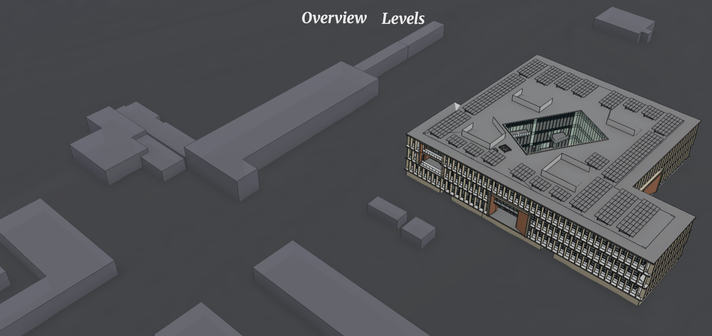
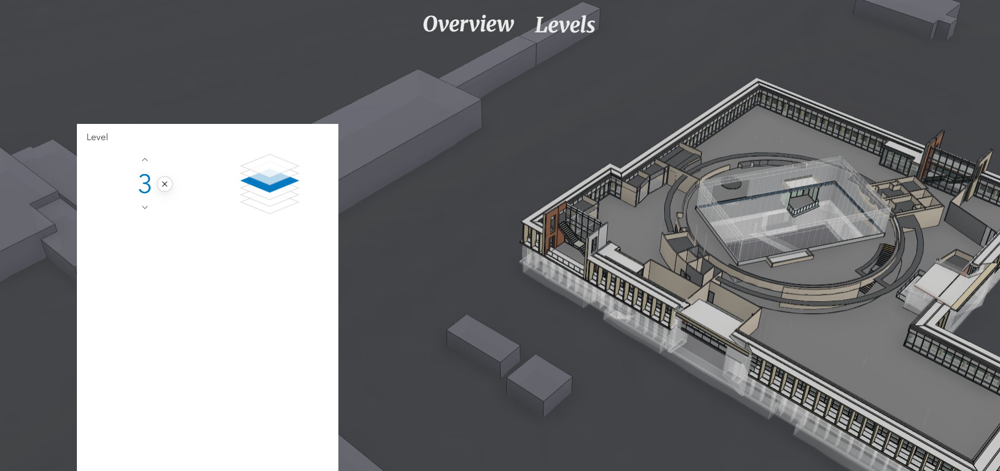
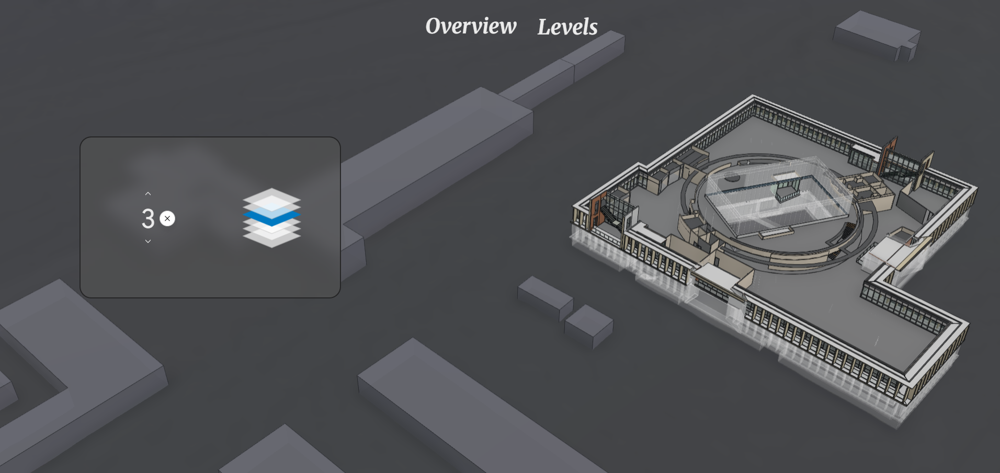

# Adding custom functionality to our Building Viewer web app with JavaScript

Last week, we stylized our Building Viewer web app and started re-adding some of the interactive functionality we lost when we removed Esri's default components:


We also refactored our code by moving the **CSS** and **JavaScript** to standalone files and importing them into our **HTML**. This made our code more organized/manageable, but also required us to _serve_ it in order for the **JavaScript** to work:

```bash
python -m http.server 5000
```

This is standard for modern web apps -- whether you're writing the code yourself or working iteratively with a LLM/agent, web apps you develop will quickly expand beyond a single **HTML** file. Like architects and engineers, developers have a myriad of tools to handle/manage their work as it grows in complexity. Today, we'll use one of those tools ([Vite](https://vite.dev/guide/)) to help us re-add some of the interactive functionality we lost when we removed Esri's default components.

## Using Vite

### Install

Requires a [Node](https://nodejs.org/en/download#debian-and-ubuntu-based-linux-distributions-enterprise-linux-fedora-and-snap-packages) installation with `npm`:

```bash
npm create vite@latest . --template vanilla
```

Follow the prompts to create a Vite project in the current directory. When you're done, you'll see the same files we've been working with (`index.html`, `style.css`, `main.js`), but in a different layout and with some extra stuff.

### Replace Vite demo with our code

Before we start adding new functionality, we need to familiarize ourself with the new project structure and move our existing code over into it:

The standard files are there, but in a different layout:

- `index.html` is still in the root of our directory
- `style.css` and `main.js` are now in a new `/src` directory
- we also have a new `/public` directory that stores an icon asset

Let's copy our existing code over:

- `styles.css` (existing code) > `/src/style.css` (from Vite)
- `main.js` (existing code) > `/src/main.js` (from Vite)
- `index.html` (existing code) > `index.html` (from Vite)

For everything to work, we'll need to update our **CSS** and **JavaScript** import paths in `index.html` to include `/src`:

```html
<head>
  ...

  <link rel="stylesheet" href="/src/style.css" />
</head>
<body>
  ...

  <script type="module" src="/src/main.js"></script>
</body>
```

And let's keep Vite's icon link but update the asset so that the web app's browser tab has a custom icon:

```html
<head>
  ...

  <link rel="icon" type="image/svg+xml" href="/favicon.ico" />

  ...
</head>
```

### Test using Vite server

The `package.json` file that Vite automatically created includes some scripts/commands for running our project locally:

```json
  "scripts": {
    "dev": "vite",
    "build": "vite build",
    "preview": "vite preview"
  },
```

We can run the first script `dev` to start our development server/serve our application locally or just run the `vite` command directly:

```bash
npm run dev
```

or

```bash
vite
```

Vite uses port `5173` by default so we should be able to view our app at `http://localhost:5173`.

## Add multiple pages/views

Now that we have our existing code working in this new structure, we're nicely setup to continue expanding on it. Let's start by adding a new page for level filtering.

### Site Navigation

We'll create a new directory at our project root named `levels` and add an `index.html` file to it. Before we dive into level filtering, let's setup navigation between our two pages:

```html
<body>
  <arcgis-scene item-id="25753f9c0d3b451d8c97273e90b61b95" popup-disabled>
    <nav>
      <h1>
        <a href="/" class="serif-text subtitle-text link">Overview</a>
      </h1>
      <h1 id="levels" class="serif-text subtitle-text link">
        <a href="/levels/" class="serif-text subtitle-text link">Levels</a>
      </h1>
    </nav>

    ...
  </arcgis-scene>

  ...
</body>
```

We can reuse some of our text styling classes for the navigation links, but we'll also want to (i) add some new styling for the navigation layout and (b) generalize the `.homeLink` class now that we have multiple link elements to style:

```css
nav {
  width: 100%;
  display: flex;
  gap: 2rem;
  margin: 1rem;
  align-items: center;
  justify-content: center;
}

.link {
  cursor: pointer;
  text-decoration: none;
}
```

We'll also add an ID to the home link element:

```html
<body>
  <arcgis-scene item-id="25753f9c0d3b451d8c97273e90b61b95" popup-disabled>
    ...

    <h2 id="home" class="serif-text title-text link" role="button" tabindex="0">
      ESRI Building E
    </h2>

    ...
  </arcgis-scene>

  ...
</body>
```

> Note: Now that we other elements on our page, the building title home link is no longer the most important in this pages hierarchy, so we'll switch it from `<h1>` to `<h2>`.

Since element IDs, unlike classes, must be unique in **HTML**, this allows us to be more specific with what we're selecting in our **JavaScript**:

```js
const homeLink = document.querySelector("#home");
```

If we had used the `.link` class to select the home link element instead, `.querySelector()` would have returned the first `.link` element it found (`<a href="/" class="serif-text subtitle-text link">Overview</a>`) instead of our actual home link element (`<h2 id="home" class="serif-text title-text link" role="button" tabindex="0">ESRI Building E</h2>`).

We can now navigate between our _Overview_ and _Levels_ pages, but _Levels_ is empty! Let's copy over our existing **HTML** from _Overview_ to _Levels_, but remove the building title/summary from the floating panel `div` element:

```html
<!doctype html>
<html lang="en">
  <head>
    <meta charset="UTF-8" />
    <link rel="icon" type="image/svg+xml" href="/favicon.ico" />
    <meta name="viewport" content="width=device-width, initial-scale=1.0" />

    <title>Building Viewer</title>

    <!-- Load Calcite components from CDN -->
    <script
      type="module"
      src="https://js.arcgis.com/calcite-components/3.3.3/calcite.esm.js"
    ></script>

    <!-- Load the ArcGIS Maps SDK for JavaScript -->
    <script src="https://js.arcgis.com/4.34/"></script>

    <!-- Load Map components from CDN-->
    <script
      type="module"
      src="https://js.arcgis.com/4.34/map-components/"
    ></script>

    <!-- Custom fonts -->
    <link rel="preconnect" href="https://fonts.googleapis.com" />
    <link rel="preconnect" href="https://fonts.gstatic.com" crossorigin />
    <link
      href="https://fonts.googleapis.com/css2?family=Google+Sans:ital,opsz,wght@0,17..18,400..700;1,17..18,400..700&family=Merriweather:ital,opsz,wght@0,18..144,300..900;1,18..144,300..900&display=swap"
      rel="stylesheet"
    />

    <link rel="stylesheet" href="/src/style.css" />
  </head>
  <body>
    <arcgis-scene item-id="25753f9c0d3b451d8c97273e90b61b95" popup-disabled>
      <nav>
        <h1>
          <a href="/" class="serif-text subtitle-text link">Overview</a>
        </h1>
        <h1 id="levels" class="serif-text subtitle-text link">
          <a href="/levels/" class="serif-text subtitle-text link">Levels</a>
        </h1>
      </nav>
      <div id="building-explorer" class="floating-pane"></div>
    </arcgis-scene>

    <script type="module" src="/src/main.js"></script>
  </body>
</html>
```

While we're at it, let's also add an ID to the floating panel `div` element so that we can select it specifically by ID in our **JavaScript**.



### Level Filtering

To re-add the level filtering functionality from Day 1, we'll re-introduce the [Building Explorer widget](https://developers.arcgis.com/javascript/latest/references/core/widgets/BuildingExplorer/) from the ArcGIS JavaScript SDK, but with some customization. Instead of placing the Building Explorer component directly in our **HTML** like we did on Day 1:

```html
<arcgis-scene item-id="...">
  ...

  <arcgis-building-explorer slot="top-right"></arcgis-building-explorer>
</arcgis-scene>
```

We'll build it in a separate **JavaScript** style -- create a file named `levels.js` in `/src/`:

```js
const [BuildingExplorer, BuildingExplorerViewModel] = await Promise.all([
  $arcgis.import("@arcgis/core/widgets/BuildingExplorer.js"),
  $arcgis.import(
    "@arcgis/core/widgets/BuildingExplorer/BuildingExplorerViewModel.js",
  ),
]);

const viewElement = document.querySelector("arcgis-scene");
const buildingExplorerRoot = document.querySelector("#building-explorer");
await viewElement.viewOnReady();

const view = viewElement.view;
view.ui.components = [];

const buildingLayer = view.map.allLayers.find(
  (layer) => layer.type === "building-scene",
);

if (!buildingLayer) {
  throw new Error("No building scene layer was found in the scene.");
}

if (!buildingExplorerRoot) {
  throw new Error("Building Explorer container was not found.");
}

const viewModel = new BuildingExplorerViewModel({
  view,
  layers: [buildingLayer],
});

const buildingExplorer = new BuildingExplorer({
  container: buildingExplorerRoot,
  view,
  viewModel,
  visibleElements: {
    phases: false,
    disciplines: false,
  },
});

buildingExplorer.when(() => {
  applyWidgetOverrides();

  observer.observe(buildingExplorerRoot, {
    childList: true,
    subtree: true,
  });
});
```

This allows us to control what parts/features of the widget we'd like to display. Since this page/view is focused on levels, we'll show level functionality but hide construction phase and discipline functionality:

```js
const buildingExplorer = new BuildingExplorer({
  container: buildingExplorerRoot,
  view,
  viewModel,
  visibleElements: {
    phases: false,
    disciplines: false,
  },
});
```

> Bonus: Follow this template/workflow for the other features, creating new pages/views for construction phase and discipline functionality. This would involves adding new pages (directory + `index.html`) and navigation (`<a>` elements in `<nav>`) like we did for levels and then building customized Building Explorer widgets for each.



We have level filtering again! But also a visual mess since Esri's default styling is clashing with our custom look/feel. To overcome this, we'll selectively override Esri's styling in our `style.css`:

```css
#building-explorer {
  display: inline-flex;
  justify-content: center;
  height: 34%;
  min-height: 0;
  box-sizing: border-box;
  border: 2px solid rgba(28, 28, 28, 0.8);
  border-radius: 18px;
  background: rgba(84, 84, 84, 0.6);
  backdrop-filter: blur(10px);
  --calcite-ui-text-1: rgb(235, 235, 235);
  --calcite-icon-color: rgb(235, 235, 235);
  --esri-widget-background-color: transparent;
}

#building-explorer * {
  font-family: "Google Sans", sans-serif;
}

#building-explorer [icon="x"] {
  --calcite-icon-color: rgb(28, 28, 28);
}

#building-explorer .esri-building-level-picker-label,
#building-explorer .esri-building-level-picker-label--empty {
  color: var(--calcite-ui-text-1);
}

#building-explorer .esri-building-level-picker-label--active {
  color: var(--calcite-ui-text-1);
}

#building-explorer .esri-building-explorer {
  width: 100%;
  max-width: 400px;
  height: 100%;
  overflow: auto;
}

#building-explorer .esri-widget__heading {
  display: none;
}

#building-explorer .esri-widget {
  border: 0 !important;
  background: transparent !important;
  box-shadow: none !important;
}
```



# Ready to ship!

Review the `/day-3` directory of this repo for the complete, final project structure and code. Once you have everything working on your end, you're ready to build and deploy our Building Viewer web app! To build, run the following in the root of the Vite directory (`/day-3` in this repo):

```bash
npm run build
```

or

```bash
vite build
```

This will create a `/dist` directory with your code and assets optimized for production. For example, if you take a look at the **CSS** and **JavaScript** files in `/dist` you'll see that they have been minified to reduce size.

Test your build by running:

```bash
npm run preview
```

or

```bash
vite preview
```

If everything looks good, you're ready to deploy! [Static website hosting in Azure Storage](https://learn.microsoft.com/en-us/azure/storage/blobs/storage-blob-static-website), [GitHub Pages](https://docs.github.com/en/pages/quickstart), and [Vercel](https://vercel.com/) all offer free hosting options. You can read more about deploying your Vite build to these options (and many others) [here](https://vite.dev/guide/static-deploy).
